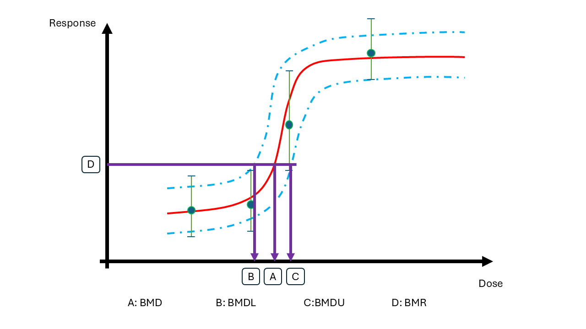

```{r}
library(ggplot2)
```


# Case description

A way to regulate chemicals is to set thresholds for what doses that are acceptable. Here we will use **Benchmark dose modelling** and **Bayesian decision analysis** to derive a highest acceptable dose, or a health based guidance value (HBGV), for a chemical.

## Benchmark dose modeling

Data is coming from a study where animals have been exposed to a chemical at multiple dose levels. The responses of each animal were measured. In Benchmark Dose modelling, a dose response curve is fitted to such data. 

BMD modelling is performed to answer the question: What is the lowest dose that causes a $p=5\%$ increase in the response relative to the background? 

Let us denote the dose level (BMD) that leads to a adverse change that is acceptable by $\psi_{p}(\theta)$, where $\theta$ are the parameters within the dose-response model. The benchmark dose (BMD) is uncertain and the task for the decision analysis is to select one value. 



Here you can explore two alternative models: A linear and a non-linear model. 


## Bayesian decision analysis

The Bayesian decision problem is to choose a HBGV informed by data $D$, let us denote this by $\delta_p(D)$. 

The decision maker argues that selecting a too high value is more serious than selecting an overly protective value. However, the HBGV should not be too protective.  

To help out, you define the decision maker's loss based on the difference between the chosen value on the HBGV $\delta_p(D)$ and the actual dose which is sufficiently protective $\psi_{p}(\theta)$ and the LINear-EXponential (LINEX) loss function.


$$L(z) = e^{\alpha z}-\alpha z - 1$$

where the difference between the chosen and the true value is $z = \delta_p(D)-\psi_p(\theta)$

Integrating $z$ into the function we get  

$$L(\delta_p(D),\psi_p(\theta)) = e^{\alpha [\delta_p(D)-\psi_p(\theta)]}-\alpha [\delta_p(D)-\psi_p(\theta)] - 1$$

When $\alpha > 0$, this loss function allows loss to increase linearly when the HBGV is lower than the actual value (i.e. on the conservative side) and exponentially when the HBGV is higher than the actual value (i.e. not protective enough). 

```{r}
alpha = 0.3

linex_z <- function(z){exp(alpha*z)-alpha*z-1}
minloss <- optimise(linex_z,c(-10,10))

ggplot(data.frame(zz = seq(-10,10,by=0.1)),aes(x=zz)) +
  geom_function(fun = linex_z, colour = "darkgreen") +
  annotate(geom="point",x=minloss$minimum, y=minloss$objective) +
  annotate(geom="text",x=-5, y=5, label = "lower/conservative") +
  annotate(geom="text",x=5, y=10, label = "higher/not protective enough") +
  labs(y = "loss", x = "z (difference to actual value)", title=paste("LINEX loss function when",expression(alpha),"is",alpha))
```


The decision maker would like to set the HBGV that minimise the loss where $p = 5\%$. 

From the Bayesian analysis we have uncertainty in parameters of the benchmark dose model. 

The Bayesian decision rule is to minimise the expected loss, where the expectation is taken with respect to uncertainty in parameters $\theta$ given information in data $D$. The so called Bayes optimal decision is then 

$$\delta_p(D)^* = \arg \min_{\delta_p(D)} E^{\theta|D}L(\delta_p(D),\psi_p(\theta))$$


# Data

(@) Obtain and inspect the data:

```{r,echo=FALSE}
downloadthis::download_file(
  path = "data_ind_single.csv",
  output_name = "BMD_data",
  button_label = "Download csv here",
  button_type = "info",
  has_icon = TRUE,
  icon = "fa fa-save",
  self_contained = FALSE
)
```


```{r}
#| echo: true
my_data <- read.csv("data_ind_single.csv")

# to make the exercise more exiting you can remove some data
#my_data <- my_data[sample.int(nrow(my_data),40),]
my_data
```


# Linear model 

A simple and naive assumption is that  1) the dose-response of the chemical follows a linear function, and 2) the error distribution at each dose is the same and follows a normal distribution. 

Linear model: 

$$Y|dose\sim N(\mu(dose),\sigma)$$
$$\mu(dose) = \beta_0+\beta_1\cdot dose$$

Prior: 

Intercept - flat prior

$$\beta_0\sim N(0,10)$$
Slope - flat but truncated at zero to ensure a positive monotonic trend 

$$\beta_1\sim N(0,5)T[0,]$$

Random error - default student-t prior 

$$\frac{\sigma}{2.5} \sim t(3)$$

Implement the linear model using `brms` (if you are using R) or directly in `stan` (if you are using R och Python).

## BRMS 

### Specify and run the model 

```{r}
library(brms)
```


```{r,eval=T}

nl_priors <- c(                         # specify priors
  prior(normal(0,10),nlpar = "beta0"),
  prior(normal(0,5),nlpar = "beta1",lb =0)
  )

linear_brms <- brm(
  bf(
    y ~ beta0 + beta1 * dose,
    nl=T,
    # center = T,decomp = "QR",
    beta0 ~ 1, beta1 ~ 1
  ),
  data = my_data,                        # change this to the name of your data
  prior = nl_priors,
  backend="cmdstanr"
)
```


### Summarise the parameters

```{r, eval=T}
summary(linear_brms)

# or use 
#brms::posterior_summary(linear_brms)
```


### Model diagnostics

Perform model validation checks. Do you consider the linear model as a good fit to the data? Tips: Plot fit, derive MCMC diagnostics, posterior predictive check.

```{r}
newdata <- data.frame(dose=seq(0,120,by=2))

ndraws = 10 # for plotting

# Linear function
get_linear <- function(x,a,b){
  return(a+x*b)
}

# extract posterior draws
post_brms <- as.data.frame(linear_brms)  # from brms
# draws_stan <- fit_Linear_ind_stan$draws(format="df") #  from stan

  
sum_post_pred <- do.call("rbind",lapply(1:nrow(newdata),function(j){
  beta0 <- post_brms$b_beta0_Intercept
  beta1 <- post_brms$b_beta1_Intercept
  pred <- get_linear(newdata$dose[j],beta0,beta1)
  data.frame(dose=newdata$dose[j],Estimate=mean(pred),Q2.5=quantile(pred,probs=0.025),Q97.5=quantile(pred,probs=0.975))
  }
))

# Generate ndraws samples of the dose-response curve
pred_draws <- do.call("rbind",lapply(1:ndraws,function(j){
  d <- sample.int(nrow(post_brms),1)
  beta0 <- post_brms$b_beta0_Intercept[d]
  beta1 <- post_brms$b_beta1_Intercept[d]
  data.frame(dose=newdata$dose,
             y=get_linear(newdata$dose,beta0,beta1),iter=as.character(j))
  }
))

# generate draws for plotting
ggplot(data=sum_post_pred,aes(x=dose,y=Estimate)) +
  geom_line(data=pred_draws,aes(x=dose,y=y,group=iter),alpha=0.3,col="red") +
  geom_line() +
  geom_line(aes(x=dose,y=Q97.5),col='blue') +
  geom_line(aes(x=dose,y=Q2.5),col='blue') +
  geom_point(data=my_data,aes(x=dose,y=y)) 
```


```{r}
# Posterior predictive check 
pp_check(linear_brms)
```


Compute $ELPD_{PSIS-LOO}$

```{r,eval=T}
# brms package has embedded loo function
loo_brms <- brms::loo(linear_brms)

loo_brms
```


## Stan 

### Specify and run the model

```{r}
library(cmdstanr)
```


The following `stan` script implements the linear model. 

```{r,eval=T}

script_linear <- "
data{                  // data block
  int N;                  // total number of subjects
  array[N] real dose;     // dose
  array[N] real y;        // response
}
parameters{            // parameter block
  real<lower=0> sigma;    // homogenous error across dose
  real beta0;             // background response
  real<lower=0> beta1;            // slope
}
transformed parameters{  // transformed parameter block
  array[N] real mu;           // store expected response as an intermediate variable
  for(n in 1:N){
    mu[n] = beta0+beta1 * dose[n];    // linear dose response  function
  }
}
model{                  // model block
  // priors                 // specify prior distributions
  beta0 ~ normal(0,10);
  beta1 ~ normal(0,5); // truncation at zero specified in the parameter block
  sigma ~ student_t(3, 0, 2.5);      // same prior distributions as brms
  // model              // specify likelihood function
  y ~ normal(mu,sigma);     
}
generated quantities{   // generate quantities for other uses
  array[N] real log_lik;    // log likelihood for elpd computation
  array[N] real y_pred;     // posterior predicted values
  for(n in 1:N){
    log_lik[n] = normal_lpdf(y[n] | mu[n],sigma);
    y_pred[n] = normal_rng(mu[n],sigma);
  }
}

"
write_stan_file(                # save to a stan file locally
  code = script_linear,dir = getwd(),
  basename = "modelcode_Linear"
)
```

Compile a stan model from a local script file

```{r,eval=T}
model_linear <- cmdstan_model("modelcode_Linear.stan")
```

`brms` and `stan` have different requirements for data. `brms` requires a dataframe, while stan requires a list where the elements match the information in the data block. Therefore, we turn the the data frame into a list. 

```{r,eval=T}
data_list <- list(                 # everything that appears in the data block
  N = nrow(my_data),               # must be included in the list
  dose = my_data$dose,
  y = my_data$y
)
priors_stan <- list()              # if extra priors are needed
```

Run MCMC to get posterior samples

```{r,eval=T}
linear_stan <- model_linear$sample( # use the $ operator to call sampling function
  data = append(data_list,priors_stan),     # cmdstan does not have separate prior argument
  # seed = 123, chains = 4,iter_sampling=1e3,
  output_dir = ".",
  output_basename = "fit_Linear"
)
```

### Summarise the parameters

```{r,eval=T}
linear_stan$summary(variables=c("sigma","beta0","beta1"))
```


### Model diagnostics

Perform model validation checks. Do you consider the linear model as a good fit to the data? Tips: MCMC diagnostics, posterior predictive check.


Plot model fitted to data 


```{r}
newdata <- data.frame(dose=seq(0,120,by=2))

ndraws = 10 # for plotting

# Linear function
get_linear <- function(x,a,b){
  return(a+x*b)
}

# extract posterior draws
post_stan <- linear_stan$draws(format="df") #  from stan

  
sum_post_pred <- do.call("rbind",lapply(1:nrow(newdata),function(j){
  beta0 <- post_stan$beta0
  beta1 <- post_stan$beta1
  pred <- get_linear(newdata$dose[j],beta0,beta1)
  data.frame(dose=newdata$dose[j],Estimate=mean(pred),Q2.5=quantile(pred,probs=0.025),Q97.5=quantile(pred,probs=0.975))
  }
))

# Generate ndraws samples of the dose-response curve
pred_draws <- do.call("rbind",lapply(1:ndraws,function(j){
  d <- sample.int(nrow(post_stan),1)
  beta0 <- post_stan$beta0[d]
  beta1 <- post_stan$beta1[d]
  data.frame(dose=newdata$dose,
             y=get_linear(newdata$dose,beta0,beta1),iter=as.character(j))
  }
))

# generate draws for plotting
ggplot(data=sum_post_pred,aes(x=dose,y=Estimate)) +
  geom_line(data=pred_draws,aes(x=dose,y=y,group=iter),alpha=0.3,col="red") +
  geom_line() +
  geom_line(aes(x=dose,y=Q97.5),col='blue') +
  geom_line(aes(x=dose,y=Q2.5),col='blue') +
  geom_point(data=my_data,aes(x=dose,y=y)) 
```


Perform the MCMC diagnostics and posterior checks

The following R script generates a spaghetti plot to compare the predictive density distribution against the density distribution of the true data

```{r,eval=T}
# Recall the y_pred variable in the generated quantities block
# It is used here
library(tidyverse)
ypred <- slice_sample(linear_stan$draws(variables = "y_pred",
                                                       format = "df"),n=100) %>%
  select(contains("y_pred"))
```

Then plot the density distribution comparison

```{r,eval=T}

# a custom function for reproducibility
plot_pred_spaghetti <- function(yraw,ysample){
  ndraws <- nrow(ysample)
  nobs <- ncol(ysample)
  df_plot <- pivot_longer(ysample,,cols = everything(),
                                 names_to = "obs",values_to = "y")
  df_plot$iter <- rep(1:ndraws,each=nobs)
  df_raw <- data.frame(
    y = yraw,iter = rep(0,nobs)
  )
  df_plot <- bind_rows(df_plot,df_raw) %>%
    mutate(type =ifelse(iter == 0,"y","ypred"))
  g0 <- ggplot(data=df_plot,
               aes(x=y,group=iter))+
    geom_density(aes(color = type))+
    geom_density(data = subset(df_plot,iter ==0),
                 aes(x=y),linewidth = 1)+
    scale_color_manual(values = c("y"="black","ypred"="lightgrey"))+
    theme_classic()
  print(g0)
  
}

plot_pred_spaghetti(yraw = data_list$y,ysample = ypred)
```

Compute $ELPD_{PSIS-LOO}$

```{r,eval=T}
# cmdstanr fit objects has loo values calculated and stored inside
loo_stan <- linear_stan$loo()
loo_stan
```


## Estimate the benchmark dose (BMD)

The benchmark dose requires inverting the function

```{r,eval=T}
# function to calculate response level at p=5% increase with a background level of f_0
get_BMR <- function(f_0,p=0.05){
  return((1+p)*f_0)
}

# extract posterior draws
post_brms <- as.data.frame(linear_brms)  # from brms
pars <- data.frame(beta0 = post_brms$b_beta0_Intercept, beta1 = post_brms$b_beta1_Intercept)

#post_stan <- linear_stan$draws(format="df") #  from stan
#pars <- data.frame(beta0 = post_stan$beta0, beta1 = post_stan$beta1)

# Find the dose that causes the estimated BMR value 
post_BMD <- unlist(lapply(1:nrow(pars),function(j){
  BMR <- get_BMR(f_0 = get_linear(0,pars$beta0[j],pars$beta1[j]), p=0.05) # we use the calculated response at dose = 0 as f_0
  obj <- function(dose){
    y_pred <- get_linear(dose,pars$beta0[j],pars$beta1[j])
    return(y_pred - BMR)
  }
result <- uniroot(obj,lower=1e-3,upper=1e3)  # find the dose that minimizes the distance
BMD <- result$root
return(BMD)
})
)

```

Each draw of parameter values from the posterior correspond to one BMD value, and therefore BMD is a full distribution based on the full posterior parameter distribution.

## Derive the HBGV for the linear model

We create a function for the expected loss given uncertainty in the estimated benchmark dose. Then we find the bayes optimal decision for different choices of the loss parameter $\alpha$

```{r}
# define function for expected loss
expected_linex <- function(delta_p,bmd,alpha){
psi_p = bmd
z = (delta_p - psi_p)
loss = exp(alpha*z)-alpha*z-1
mean(loss)
}

# find bayes optimal
alpha_val = c(0.3,4,10)
bayes_opt = unlist(lapply(alpha_val,function(a){
optimise(f=expected_linex,interval=c(0,10),bmd=post_BMD,alpha=a)$minimum
}))

df_b <- data.frame(alpha=as.character(alpha_val), hbgv=bayes_opt)
```


```{r}
#| warning: false

  ggplot(data=data.frame(psi_p=post_BMD),aes(x = psi_p)) +
    geom_density()+
    geom_vline(data=df_b,aes(xintercept=hbgv,col=alpha,show.legend = alpha),linetype="dashed") +
  labs(x = expression(psi[p](theta)),
       y = "pdf",
       title = "Uncertainty in the quantity of interest",
       subtitle = "and HBGVs for different loss functions") +
    theme_light()

```

(@) What happens with the derived Health Based Guidance Value when we change the loss function parameter $alpha$?  

# Non linear model

Consider the following Hill dose-response function as an alternative to the linear function:

$$Y|dose \sim N(\mu(dose),\sigma)$$
$$
\mu(dose) = a+ \frac{b \cdot dose^g}{c^g+dose^g}
$$

## Estimate BMD

Replace the linear function with the non-linear one. Note that you have more parameters for the non-linear function. 

(@) Is the non-linear model a better choice than the linear one? Does it have a better goodness-of-fit? 

## Derive the HBGV 

Derive the HBGV using the this Hill function for the dose-response model. 

(@) What happened with the derived Health based guidance value when going from linear to non-linear model? 
