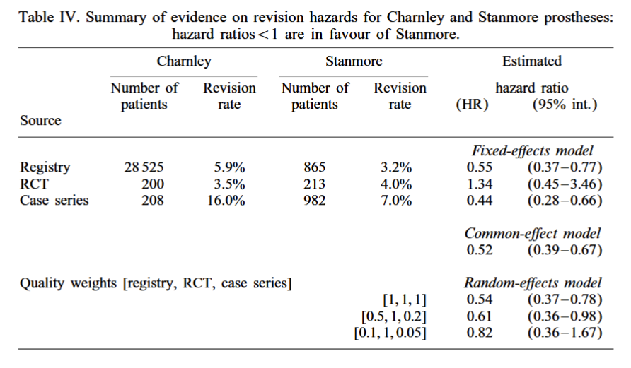

  
 
```{r}
#| warning: false
#| message: false
library(cmdstanr)
library(ggplot2)
library(bayesplot)
```

# Case study description

A Bayesian evidence synthesis can be seen as a calibration of a model with multiple sources of evidence. Spiegelhalter and Best (2003) demonstrates a one step approach for forward and backward Bayesian sampling, to keep a consistent characterisation of uncertainty. 

The aim of this case study is to reproduce the parametric inference in their paper (Bayesian evidence synthesis with bias adjustment) and apply a simple decision model using stochastic dominance to evaluate which alternative to choose. 


## Decision analysis using info-gap decision theory


## Parametric inference 

### Data
  
```{r}
df_sb <- data.frame(
  n = c(28525,865,200,213,208,982),
  revision = c(5.9,3.2,3.5,4,16,7),
  obs = round(c(28525*0.059,865*0.032,200*0.035,213*0.04,208*0.16,982*0.07)),
  treatment = rep(c('Charnley', 'Stanmore'),3),
  stream = rep(c('Registry', 'RCT', 'Case series'),each=2))

df_sb # View data
```

# Model for evidence synthesis

Let $r_{ik}$ be the number of patients requiring a revision operation out of $N_{ik}$ patients that receiving prosthesis $i$ (1=Charnely, 2=Stanmore) in study $k$
  
$$r_{ik}\sim Bin(\theta_{ik},N_{ik})$$
The cumulative hazard up to the average follow-up is derived from the proportion requiring revision $\theta_{ik}$ as 

$$H_{ik}=\log(\frac{1}{1-\theta_{ik}})=-\log (1-\theta_{ik})$$
  
The hazard ratio for Stanmore versus Charnley is defined as $HR_k=\frac{H_{2k}}{H_{1k}}$, which is the same as 

$$\log HR_k = \log H_{2k}-\log H_{1k}$$

## Original model specification

In the original paper by Spiegelhalter and Best (2003), the study-specific hazard ratio is modelled as 

$$\log HR_k \sim N(\log \overline{HR},\frac{\sigma}{q_k})$$


```{r}
script_sb_paper <- "

data {
  int<lower=1> n;  // total number of observations
  array[n] int r;  // response variable
  array[n] int N;  // number of trials
  array[n] int x;  // population-level design matrix
  int<lower=1> K;  // number of grouping levels
  array[n] int<lower=1> g;  // grouping indicator per observation
  array[K] real q; // quality terms
  vector[2] hyper_sigma; // hyper parameters for sigma prior
}
parameters {
  matrix<lower=0,upper=1>[K,2] theta;  // 
  real<lower=0> sigma;
}
transformed parameters {
  matrix[K,2] logH; // cumulative hazard
  logH = log(-log(1-theta));
  vector[K] logHR; // hazard ratio
  logHR = logH[,1] - logH[,2];
  real avlogHR; // average of hazard ratios
  avlogHR = mean(logHR); 
}
model {
  // prior
  to_vector(theta) ~ beta(1,1);
  sigma ~ normal(hyper_sigma[1],hyper_sigma[2]); // gamma(14,70); // informed prior similar to normal(0.2,0.05);
  
  // likelihood
    for (id in 1:n) {
      r[id] ~ binomial(N[id],theta[g[id],x[id]]); // observations
    }
    for (j in 1:K) {
      logHR ~ normal(avlogHR, sigma/q[j]); // random effects
    }
}
generated quantities {
  real HR; // hazard ratio
  HR = exp(avlogHR); 
}

"
write_stan_file(                # save to a stan file locally
  code = script_sb_paper,dir = getwd(),
  basename = "modelcode_sb_paper"
)
```


```{r}
# turn data to list
stan_data <- list(n = nrow(df_sb), K = nrow(df_sb)/2, N = df_sb$n, r = df_sb$obs, x = 1+1*(df_sb$treatment=="Stanmore"), 
                  g = rep(1:3,each=2), 
                  q = c(1,1,1) # quality weights resulting in 0.54 (0.37-0.78)
                  #q = c(0.5,1,0.2) # quality weights resulting in 0.61 (0.36 - 0.98)
                  #q = c(0.1,1,0.05) # quality weights resulting in 0.82 (0.36 - 1.67)
)

# prior specification 
list_priors <- list(
  hyper_sigma = c(0.2,0.05),
  hyper_theta = c(-3,0.5) # binomial probability parameters, should be small
)

# compile model
model.sb_paper <- cmdstan_model("modelcode_sb_paper.stan") # the first time may take long to perform

# perform the mcmc sampling
post <- model.sb_paper$sample(data=append(stan_data,list_priors), seed = 1975, step_size = 0.1)
```


```{r}
# check convergence
post$diagnostic_summary()

```

```{r}
# summarise the relevant quantities of interest 
draws <- post$draws()
bayesplot::mcmc_trace(draws,pars = "HR")
```

## Alternative model specification

This specification is problematic, since the likelihood is based on an average of three parameters. 

Instead, we implement the model by letting $\delta_k = \log HR_k$ be a study specific log hazard ratio and $\mu$ be the expected value of the overall log of the hazard ratio

$$\delta_k \sim N(\mu,\frac{\sigma}{q_k})$$

We let parameter $\eta_k$ be a study specific average of the log cumulative hazards, and calculate cumulative hazard ratios as 

$$\begin{split} \log H_{1k} &= \eta_k - \frac{\delta_k}{2} \\ 
\log H_{2k} &= \eta_k + \frac{\delta_k}{2} 
\end{split}$$

## Prior specification 
  
We use a normal-distribution for the log of the overall hazard ratio and for the average log cumulative hazard parameters

$$\mu \sim N(0,2)$$
Study-specific log hazard are small numbers
$$\eta_{k} \sim N(-3,0.5)$$
  
From the paper: The three studies do not provide sufficient evidence to accurately estimate the between-study standard deviation $\sigma$, so substantial prior judgement is necessary. For this we used a truncated normal 

$$\sigma \sim N(0.2,0.05)T[0,]$$
  

(@) Draw the graph for the Bayesian model! 





## Implement Bayesian model calibration 

Below is the stan script for the respecified model. 

```{r}

script_sb <- "
data {
  int<lower=1> n;  // total number of observations
  array[n] int r;  // response variable
  array[n] int N;  // number of trials
  array[n] int x;  // population-level design matrix
  int<lower=1> K;  // number of grouping levels
  array[n] int<lower=1> g;  // grouping indicator per observation
  array[K] real q; // quality terms
  vector[2] hyper_sigma; // hyper parameters for sigma prior
  vector[2] hyper_mu; // hyper parameters for mu prior
  vector[2] hyper_eta; // hyper parameters for eta prior
}
parameters {
  real mu; // overall log hazard ratio
  real<lower=0> sigma; // between study variation in log hazard ratio
  vector[K] eta; // study specfic average log cumulative hazard between the two interventions
  vector[K] delta; // study specific difference in log cumulative hazards of the two interventions
}

model {
    matrix[K,2] theta; // binomial parameter for each intervention and study
  
  // prior
  to_vector(eta) ~ normal(hyper_eta[1],hyper_eta[2]);
  mu ~ normal(hyper_mu[1],hyper_mu[2]); 
  sigma ~ normal(hyper_sigma[1],hyper_sigma[2]) T[0,]; // informed prior similar to normal(0.2,0.05);
  
  // random effects
  for (j in 1:K) {
    delta[j] ~ normal(mu,sigma/q[j]);
    theta[j,1] = 1-exp(-exp(eta[j] - delta[j]/2));
    theta[j,2] = 1-exp(-exp(eta[j] + delta[j]/2));
  }
  

  // likelihood
    for (id in 1:n) {
      r[id] ~ binomial(N[id],theta[g[id],x[id]]); // observations
    }
}

generated quantities {
  real HR; // overall hazard ratio
  HR = exp(mu);
}

"
write_stan_file(                # save to a stan file locally
  code = script_sb,dir = getwd(),
  basename = "modelcode_sb"
)
```


```{r}
# turn data to list
stan_data <- list(n = nrow(df_sb), K = nrow(df_sb)/2, N = df_sb$n, r = df_sb$obs, x = 1+1*(df_sb$treatment=="Stanmore"), 
                  g = rep(1:3,each=2), 
                  #q = c(1,1,1) # quality weights resulting in 0.54 (0.37-0.78)
                  #q = c(0.5,1,0.2) # quality weights resulting in 0.61 (0.36 - 0.98)
                  q = c(0.1,1,0.05) # quality weights resulting in 0.82 (0.36 - 1.67)
)

# prior specification 
list_priors <- list(
  hyper_sigma = c(0.2,0.05),
  hyper_eta = c(-3,0.5),
  hyper_mu = c(0,2)
)

# compile model
model.sb <- cmdstan_model("modelcode_sb.stan") # the first time may take long to perform

# perform the mcmc sampling
post <- model.sb$sample(data=append(stan_data,list_priors), seed = 1975, step_size = 0.1)
```


```{r}
# check convergence
post$diagnostic_summary()
```

```{r}
post$summary(variables=c("HR","mu","sigma"))
```

```{r}
# summarise the relevant quantities of interest 
draws <- post$draws()
bayesplot::mcmc_trace(draws,pars = "HR")
```

```{r}
bayesplot::mcmc_dens(post$draws(),pars = "HR", prob=0.8)
```


```{r}
post_stan <- post$draws(format="df")
mean(post_stan$HR>1)
```

# Decision analysis 

Recall that a hazard ratio less than 1 is in favour of Stanmore. We can summarise uncertainty in the hazard ratio by the probability that it is less than 1, i.e. $P(HR<1)$ and select Stanmore if this probability is acceptably high. Here, the probability is a performance measure. A value close to 50% implies that there is no difference between the two methods. 

Now we run the analysis for increasingly stronger assumptions about the bias adjustement terms, derive the performance measure. 

```{r}
alpha_vals <- seq(1,5,by=0.5)

results <- do.call('rbind',lapply(alpha_vals,function(alpha){
  
# turn data to list
stan_data <- list(n = nrow(df_sb), K = nrow(df_sb)/2, N = df_sb$n, r = df_sb$obs, x = 1+1*(df_sb$treatment=="Stanmore"), 
                  g = rep(1:3,each=2), 
                  q = c(1/alpha,1,1/alpha/2) # quality weights 
)

# perform the mcmc sampling
post <- model.sb$sample(data=append(stan_data,list_priors), seed = 1975, step_size = 0.1, refresh = 0)

post_stan <- post$draws(format="df")
data.frame(alpha=alpha, performance=mean(post_stan$HR<1))
})
)


```

```{r}
ggplot(results,aes(x=alpha, y=performance)) +
  geom_line() +
  xlab("alpha: magnitude of bias adjustement") +
  ylab("P(HR<1): Stanmore better than Charnley") 
```


```{r}
ggplot(results,aes(x=performance, y = alpha)) +
  geom_line() +
  xlab("P(HR<1): Stanmore better than Charnley") +
  ylab("alpha: Horizon of uncertainty")
```


