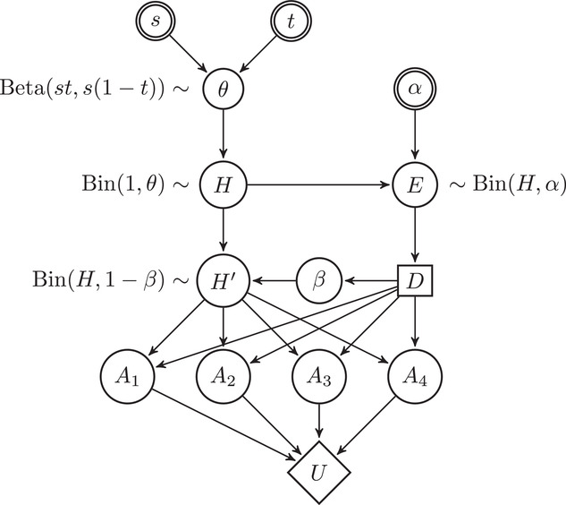
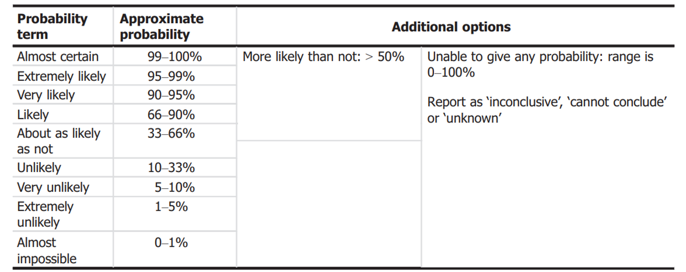
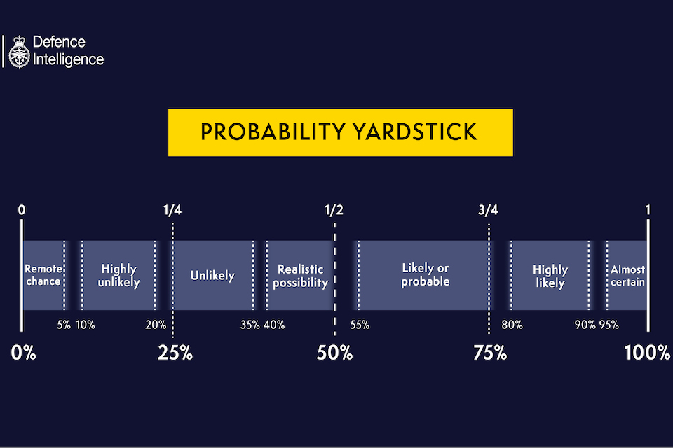
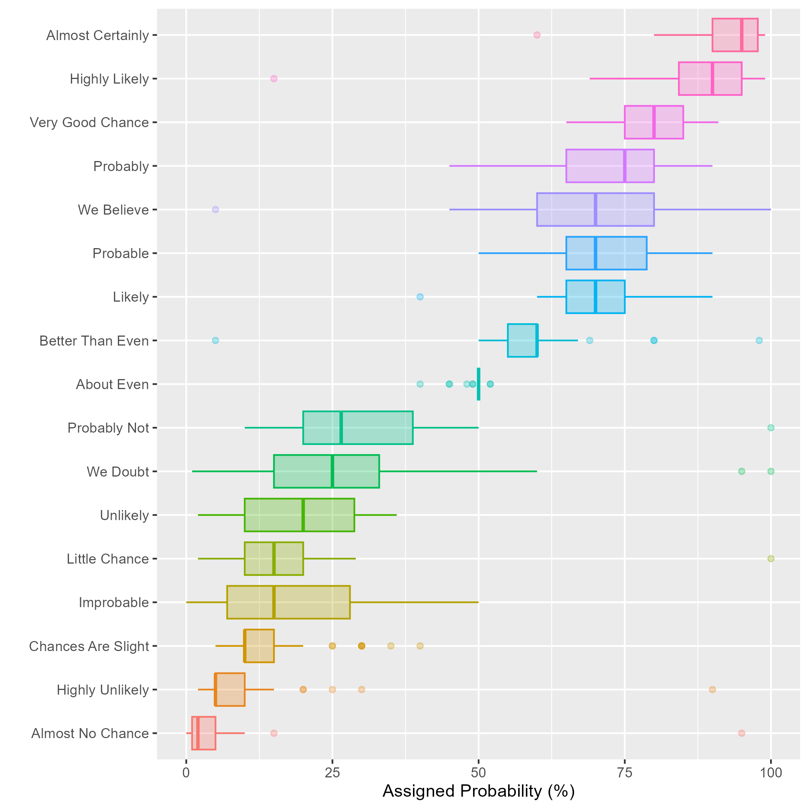

```{r}
library(ggplot2)
```


# Sure thing principle

Umbrella

# Bayes optimal decisions

Graph 

$$\delta(D)^* = \arg \max_{\delta} E^{\theta|D}U(\delta)$$

# The stan example


# Multi-attribute utility 

Let $U(a_i)$ be the utility on a specific attribute $a_i$

Additive utility function 

$$U(a_1,\dots,a_n)=\textstyle\sum_{i=1}^n k_i U_i(a_i)$$

If we can identify attributes and create utilities over them, we can construct an overall utility function


[link to crayfish paper](https://onlinelibrary.wiley.com/doi/10.1111/risa.13722)



# Bounded probabilities

Imprecise probability theory. 

From $P$ to $\underline P, \overline P$

Derive lower bound on expected utility and maximise that.

$$\delta(D)^* = \arg \max_{\delta} \underline E^{\theta|D}U(\delta)$$

# Portfolio theory 

A portfolio is a linear combination of assets

The assets vary over time (backward or forward looking)

The efficiency frontier is determined by the mean-variance relationship 

Variance is a measure of risk 

Covariation between assets play a large role since it influences the variance and thereby where a portfolio lies in relation the efficieny frontier 


## Multi-criteria decision making

- screen out inferior options

- consider and weight in multiple criteria


## Decision analysis using stochastic dominance

A decision rule of stochastic dominance. Note that this is not a Bayesian decision rule. 

Let us denote uncertainty in a quantity of interest $Q$ under two decision alternatives $A$ and $B$, as $Q_A$ and $Q_B$. Alternative $A$ is stochastically dominating alternative $B$ of the first order if 

$$P(Q_A\leq q) < P(Q_B\leq q) \ \forall q $$
In other words, $A$ is better than $B$ if the cumulative probability distribution for A is always to the right of the cumulative probability distribution for $B$. 

```{r}
pp <- ppoints(200)
df <- data.frame(Q = c(qnorm(pp,2,1),qnorm(pp,-1,2)), cdf=pp,Alternative = rep(c("A","B"),each=length(pp)))
ggplot(df,aes(x=Q,y=cdf,col=Alternative)) +
  geom_line()
```


# Robust decison making 

- Keep options open

Quantitative: Scenario based analysis 

Fruit break and buses


# Uncertainty analysis 

## Steps

- Identify sources of uncertainty 

- Evaluate the combined impact on the conclusion 

- Communicate (un)certainty in conclusion

## Characterisation of overall uncertainty 

Evaluate in one step the impact of all sources of uncertainty using expert judgement. 

OR

Break assessment into parts, evaluate the impact on the parts and combine by calculation. Then evaluate the combined impact of any **additional sources of uncertainty**  on the conclusion. 

## Summarise well

- Avoid multiple summaries with an unclear relation 

e.g. summaries of indirect and direct uncertainty  (exaplained in class)

## Use an expression of uncertainty for which there is a decision rule that the decision maker is willing to use

- Make sure the decision maker has a decision rule given the way uncertainty is expressed 

Bayesian decision theory matches uncertainty expressed by subjective probability 

second order uncertainty, e.g. a bound on a probability can be minimax rule

second order uncertainty, where the second order measure indicates reliability of the assessment, set a threshold for reliability and use the resulting bounds with the minimax decision rule 

info-gap decision theory - info-gaps

qualitative expression, low, moderate, high - define a rule for what action to take given the qualitative expression

Scenario analysis - an option to consider non-quantified uncertainties

## Use sensitivie analysis to support characterisation

- Use sensitivity analysis to support the characterisation of overall uncertainty

Sensitivity analysis is not a way to quantify uncertainty, it helps to evaluate the influence of changes in model (parameter, structure, assumptions) on the quantity or outcome of interest (model output)

## Communicate remaining uncertainties 

- Communicate any remaining uncertainties that are not taken into account in the characterisation of overall uncertainty

- Use verbal to support quantitative expressions (not the other way around)






